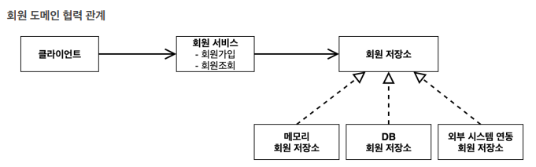
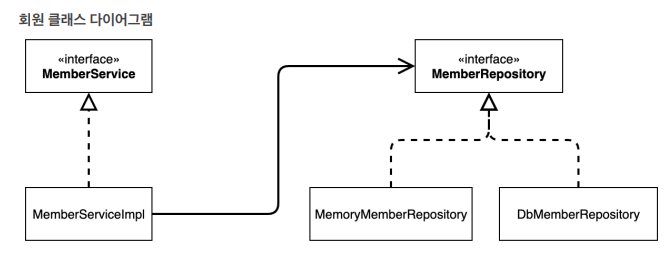

# 프로젝트 버전
 - Project: Gradle - Groovy Project
 - Spring Boot: 2.7.16
 - Language: Java
 - Java: 11
 - IDE : IntelliJ

---

회원등급별 할인 주문서비스

---

# 비즈니스 요구사항과 설계
[회원]
 - 회원을 가입하고 조회할 수 있다.
 - 회원은 일반과 VIP 두 가지 등급이 있다.
 - 회원 데이터는 자체 DB를 구축할 수 있고, 외부 시스템과 연동할 수 있다. (미확정)

[관리자]
 - 회원은 상품을 주문할 수 있다.
 - 회원 등급에 따라 할인 정책을 적용할 수 있다.
 - 할인 정책은 모든 VIP는 1000원을 할인해주는 고정 금액 할인이 있다. (미확정)

---

# 회원 도메인 설계
 - 회원 도메인 요구사항
 - 회원을 가입하고 조회할 수 있다.
 - 회원은 일반과 VIP 두 가지 등급이 있다.
 - 회원 데이터는 자체 DB를 구축할 수 있고, 외부 시스템과 연동할 수 있다. (미확정)

---

  

