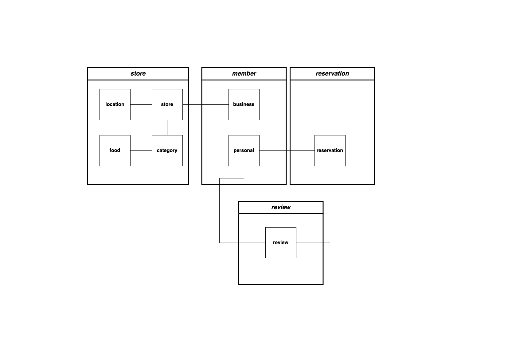
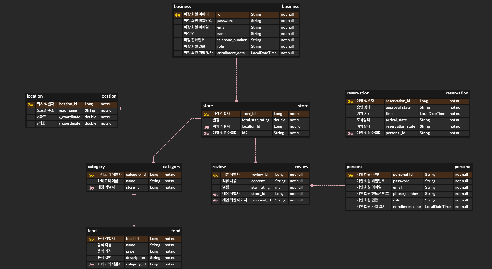

# 매장 테이블 예약 서비스

## 🎯 프로젝트 목표
예약 서비스를 활용하고 싶은 매장은 매장 정보를 등록할 수 있다.   
매장 예약 서비스에 가입한 회원은 방문을 희망하는 매장을 예약할 수 있는 서비스 제작

## 🖥 개발 환경
```text
- java(Open JDK 11)
- gradle 
- spring boot 2.7.13
- spring security, spring JPA, MYSQL DB
```

## commit rule
- commit 키워드
  - 기능 구현: feat
  - 기능 수정: refactor
  - 문서 작업: docs
  - 테스트 코드: test

## 📌기능 요구 사항

### 매장관리자(점장)
-[x] 파트너 가입 기능 (승인 조건 없음, 가입즉시 이용가능)
-[x] 매장정보를 등록하는 기능 (매장명, 상점위치, 상점 설명)
-[ ] 예약이 들어오면 점장 승인/예약거절 기능

### 이용자(고객)
-[ ] 방문 예약 진행 (회원 가입 필수)
-[ ] 서비스를 통해 매장 검색, 상세 정보 확인
-[ ] 서비스를 통해 예약한 이후, "예약 10분전에 도착하여 키오스크를 통해서 방문 확인을 진행"
-[ ] 예약 및 사용 이후에 "리뷰를 작성"(수정권한 : 작성자 / 삭제권한 : 작성자, 관리자)

### 제약사항
-[ ] "10분 이후에 오는경우 예약 불가"

## 도메인 클래스 다이어그램


## ERD



