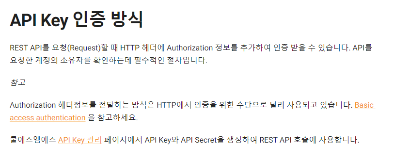
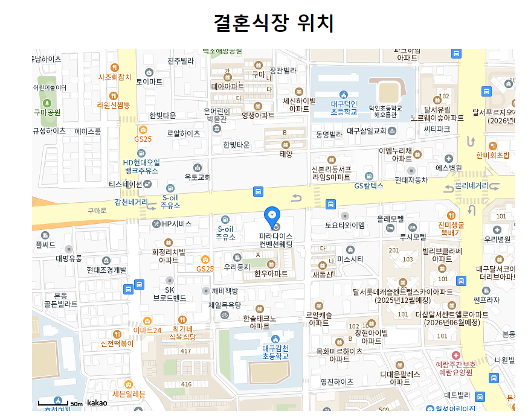
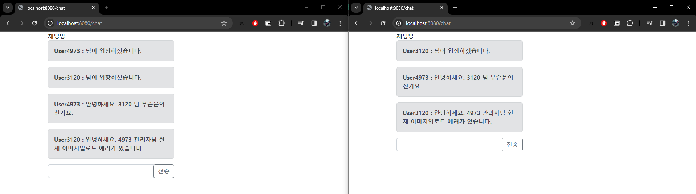

# 청첩장 커스터마이징

## 🎯 프로젝트 목표
목적: 청첩장을 직접 만들어 비용절감 효과
- 최근 친한친구가 결혼을 하게되어 이야기를 하던도중, 청첩장을 업체 맡길경우 비용이 3~5만원 별도로 비용이 발생한다는걸 알게되었습니다. (생각보다 비용이 큰것 같음)
- 누구나 쉽게 청첩장을 커스터마이징하는 서비스를 제공하면 어떨까 고민하다가 개인프로젝트로 만들게 되었습니다.

## 🖥 개발 환경
```text
- java(Open JDK 17)
- gradle 
- spring boot 3.1.10
- spring security, spring JPA, MYSQL DB, S3, Auth 2.0, WebSocket
```

## commit rule
- commit 키워드
  - 기능 구현: feat
  - 기능 수정: refactor
  - 문서 작업: docs
  - 테스트 코드: test

## 📌기능 요구 사항

### 회원가입 및 로그인
- 사용자들은 청첩장 커스터마이징 서비스를 이용하려면 카카오톡 or 네이버 로그인을 이용해 회원가입(필수)을 진행해야 합니다. 
- 소셜로그인을 통해 회원들은 좀더 편리하게 서비스 이용이 가능합니다.
- [ ] 카카오 Auth2.0 소셜로그인 
- [ ] Authorization: JWT 사용
- [ ] 최초 로그인시 정보제공 여부확인, 가입이후 자동로그인


### 문자 인증
- 본인 인증을 확인하기 위해 소셜로그인한 계정명의와 핸드폰이 일치해야 회원가입이 가능합니다.
- [ ] 회원가입시 문자인증
- [ ] coolsms API 서비스를 통한 인증방식
- [ ] 인증번호 틀린경우 가입불가



### 이미지 업로드
- 원하는 사진들을 업로드 할수 있습니다.
- [ ] Amazon S3 사진 업로드


### 위치 서비스
- 디폴트 값으로 결혼식장 위치 설정이 가능하고, 현재 나의 위치까지 거리를 파악할수 있습니다.
- [ ] 카카오 API를 이용해 위치제공



### 댓글
- 청첩장 커스터마이징을 완료한 URL 접속시 댓글을 작성할수 있습니다.
- [ ] IP or 카카오톡 ID 정보가 남습니다.



## ERD 


## PR 양식
```
### 변경사항
<!-- 이 PR에서 어떤점들이 변경되었는지 기술해주세요. 가급적이면 as-is, to-be를 활용해서 작성해주세요.  -->
**AS-IS**

**TO-BE**

### 테스트
<!-- 본 변경사항이 테스트가 되었는지 기술해주세요 --> 
- [ ] 테스트 코드
- [ ] API 테스트 
```

## Trouble Shooting 양식

```
오류 발생

원인

해결 방법
```